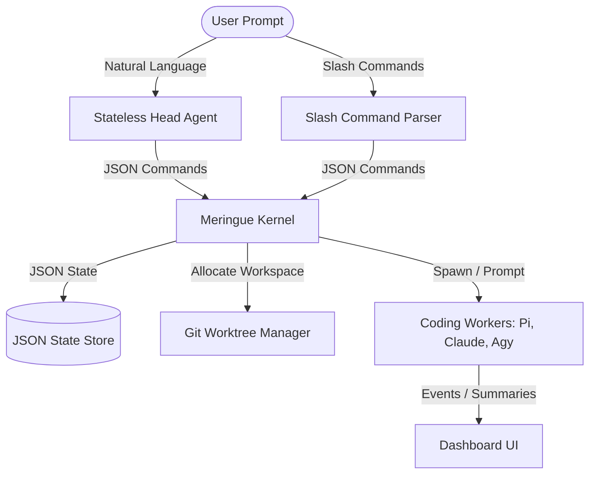

# 🧁 Meringue

> **A Terminal-based Multi-Agent Orchestrator for Developer Workflows.**
> Meringue coordinates, monitors, and drives multiple AI coding agents working in parallel on different tasks and branches in your codebase—all within a single, unified terminal session.

---

## 🚀 The Core Mission

### The Problem
In the era of AI, developers can generate solutions and iterate on code faster than ever. However, the bottleneck has shifted:
* **Context Switching:** Developers often find themselves running multiple terminal tabs, each with a different agent working on a separate problem.
* **Terminal Hopping:** Reorienting yourself, checking outputs, issuing prompts, and managing different environment setups across multiple checkouts is slow, confusing, and exhausting.

Existing coding harnesses (like Pi, Claude Code, or Antigravity) are fantastic for deep-diving into a single issue. But they aren't designed to orchestrate multiple parallel threads of work without starting multiple independent tool instances.

### The Solution: Meringue
Meringue sits on top of your favorite coding harnesses (like a meringue on a pie 🥧) and provides a command-center interface to:
1. Manage **multiple agents concurrently** on different branches and tasks.
2. Maintain an **append-only structured logs dashboard** to track progress at a glance.
3. Automatically allocate **isolated workspaces** via Git worktrees so agents never trample each other's changes.
4. Interact seamlessly via an **unblocked chat window** that routes natural language requests to stateless head agents, which coordinate the actual coding workers.

---

## 🏗️ Architecture & Features

Meringue is divided into three key layers:



### 1. The Head Agents (Stateless Event Loop)
When you submit a natural language prompt, Meringue spawns a stateless **Head Agent** (analogous to the Node.js event loop).
* Heads do **not** edit files directly.
* Instead, they inspect the codebase, locate target projects, and return structured **Kernel Commands** in JSON.
* If a Head needs clarification, it generates a structured **Question** for the user and terminates, keeping the TUI unblocked.

### 2. The Kernel & Workspace Manager
The Ruby **Kernel** is the single source of truth that mutates Meringue state.
* **Validation:** Validates proposed commands from Heads or CLI slash commands before applying them.
* **Workspace Isolation:** Allocates a dedicated git worktree for each spawned worker, naming branches after the user-facing task title (e.g., `meringue/fix-signup-validation-a1b2c3d4`).
* **Harness Agnosticism:** Communicates with backend harnesses using a generic process manager interface. Currently supports **Pi** (RPC JSONL interface), **Claude Code**, and **Antigravity**.

### 3. The Interactive TUI (Terminal User Interface)
The TUI organizes your screen into three main sections:
* **Chat Window:** An auto-resizing chat input bar for natural language prompting and fallback slash commands (like `/help`, `/project`, `/worker`).
* **AgentTree:** A file-tree-like visualization where projects are roots, issues are folders, and workers are files. You can navigate the tree and "jump" directly into any active worker's terminal session.
* **Logs Pane:** A centralized, scrollable history showing kernel commands, worker state transitions, and important RPC events.

---

## 🛠️ Quick Start

### Prerequisites
* **Ruby** (>= 3.2 recommended)
* **Git** (for worktree isolation)
* **Alacritty** or **tmux** (for terminal session jump mode)
* Supported harnesses installed (e.g., `pi`, `claude`, or `agy`)

### Installation
Clone the repository and run the setup script:
```bash
git clone https://github.com/your-username/meringue.git
cd meringue
bundle install
```

### Run Meringue
```bash
# Start the interactive TUI (uses default harness configuration)
bin/meringue

# Run using Claude Code as the harness provider
bin/meringue tui --harness claude

# Run with a custom head/worker provider split
bin/meringue tui --head-harness antigravity --worker-harness claude

# Run the demo mode with fake pre-populated state (great for exploring the UI!)
bin/meringue demo
```

---

## ⚙️ Configuration

Meringue reads its configuration from `~/.meringue/config.toml` (and stores state in `~/.meringue/state.json`).

Here is an example `config.toml`:

```toml
[tui]
colorscheme = "meringue" # Supported: meringue, rose-pine, tokyonight, gruvbox, catppuccin, kanagawa

[harness]
provider = "pi"              # Default for both heads and workers
# head_provider = "claude"   # Optional override
# worker_provider = "antigravity"

[harness.pi]
command = "pi"
session_dir = "~/.meringue/pi-sessions"
head_extra_args = ["--thinking", "high", "--tools", "read,bash,grep,find,ls"]
worker_extra_args = ["--thinking", "high", "--tools", "read,bash,grep,find,ls,edit,write"]

[harness.claude]
command = "claude"
use_json_schema = true
head_extra_args = ["--effort", "high", "--permission-mode", "plan"]
worker_extra_args = ["--effort", "high", "--permission-mode", "acceptEdits"]
```

---

## ⌨️ TUI Keyboard Shortcuts

| Shortcut | Action |
| :--- | :--- |
| **Global** | |
| `Ctrl-D` | Quit Meringue |
| `Ctrl-C` | Clear prompt input / Quit TUI if input is empty |
| `Tab` / `Ctrl-Tab` | Focus next panel |
| `Shift-Tab` | Focus previous panel |
| **Chat Input** | |
| `Enter` | Send prompt or select completion |
| `Shift-Enter` | Insert a newline |
| `/` | Show slash command completion popup |
| **AgentTree / Navigation** | |
| `Up` / `Down` / `Left` / `Right` | Scroll panel / Navigate trees |
| `Enter` (when tree focused) | Enter **Jump Mode** |
| `p` (in Jump Mode) | Open the selected agent's pull request in your browser |
| `Esc` | Cancel Jump/PR navigation |

---

## 💬 Slash Commands

Type `/` in the prompt to access these built-in control commands:

* `/help` — List all command syntax
* `/project add <path> [name]` — Manually register a codebase
* `/issue create <project_id> "<title>"` — Create a new issue folder
* `/worker spawn <issue_id> "<prompt>"` — Spawn a worker agent on an issue
* `/prompt <agent_id> "<message>"` — Send a direct follow-up prompt to a worker
* `/jump [agent_id]` — Open an agent terminal session (omit ID to navigate via keyboard)
* `/jumpr [agent_id]` — Open an agent's GitHub Pull Request in your browser
* `/theme <name>` — Set and persist the TUI theme
* `/harness <pi|claude|antigravity>` — Select the harness backend for future agents
* `/kill <id>` — Kill an agent, issue, or project subtree
* `/quit` — Exit Meringue

---

## 🤝 Contributing
Please read [AGENTS.md](file:///Users/jacksonlafrance/.meringue/workspaces/meringue/write-readme-md-7e901936/AGENTS.md) for our detailed architectural principles, agent workflows, testing constraints, and Git branching rules.
